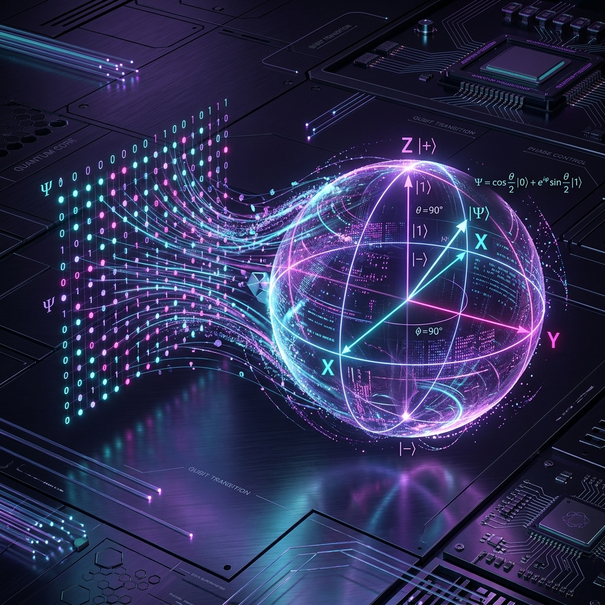
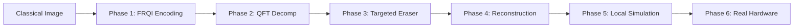

# Beyond the Barren Plateau: Quantum Image Compression



> **A Deterministic, Training-Free Quantum Image Compression Pipeline via FRQI Encoding and QFT Frequency Truncation.**

---

## 🌟 Overview

This repository contains the source code and research for a novel **Quantum Image Processing (QIP)** pipeline. Unlike traditional **Quantum Autoencoders (QAEs)** that rely on variational circuits and gradient descent, this project utilizes a **deterministic mathematical approach** to compress image data.

By replacing the stochastic "AI" training loop with a hard-coded **Quantum Fourier Transform (QFT)** and a targeted **Decoupling Sequence**, we effectively eliminate the risk of **Barren Plateaus**—a major bottleneck in modern Quantum Machine Learning.

### 🧪 Key Breakthroughs
- **Zero Training Needed**: Immune to vanishing gradients (Barren Plateaus).
- **Infinite Scalability**: Represent $N$ pixels in just $\log_2(N) + 1$ qubits.
- **NISQ-Viable**: Designed with a short gate depth to survive noise on today's real quantum processors.

---

## 🛰️ The Pipeline Architecture

The system executes as a six-phase sequential pipeline. Each phase transforms the quantum state to prepare it for the next stage of compression.



### 1. FRQI Image Encoding
We encode the image using the **Flexible Representation of Quantum Images (FRQI)** protocol. 
- **Position Register**: Stores the $(x, y)$ coordinate of the pixel.
- **Color Qubit**: Stores the pixel intensity as a rotation angle $\theta$.

$$ |I\rangle = \frac{1}{\sqrt{N}} \sum_{i=0}^{N-1} (\cos\theta_i|0\rangle + \sin\theta_i|1\rangle) \otimes |i\rangle $$

### 2. QFT Frequency Analysis
The **Quantum Fourier Transform** acts as a mathematical prism. It separates the spatial pixel data into frequency components, concentrating broad image structures into low frequencies and sharp transitions into high frequencies.

### 3. The "Eraser" (Custom Decoupling)
This is the core innovation. We apply a targeted sequence of three gates to the high-frequency qubit to drive it to $|0\rangle$ through **destructive interference**:
$$ R_y(\pi/4) \longrightarrow H \longrightarrow CNOT \Longrightarrow |t_{\text{final}}\rangle = |0\rangle $$
This effectively erases high-frequency information (noise or fine detail) deterministically.

---

## 📁 Repository Structure

### `src/` (The Engine)
- **`quantum_data_project_.py`**: The complete, end-to-end master script. Includes encoding, processing, and hardware connection.
- **`quantum_ibm_hardware.py`**: A specialized script for connecting to real IBM Quantum processors using the modern `SamplerV2` primitive.
- **`quantum_local_simulation.py`**: A modular script for fast iteration using the `AerSimulator`.

### `notebooks/` (Research & Development)
- **`Quantum_project_notebook.ipynb`**: The primary research environment. Contains detailed visualizations of Bloch spheres and measurement histograms.
- **`Quantum_data_project_.ipynb`**: Exploratory notebook used for initial parameter tuning and gate sequence testing.

### `docs/` (The Theory)
- **`Beyond_the_Barren_Plateau_Quantum_compression_ArXiv.pdf`**: The full research paper detailing the mathematical proof and experimental results.
- **`Quantum_Research_Paper.html`**: A high-fidelity, interactive HTML version of the research paper.

---

## 📊 Experimental Results

We validated the pipeline on two distinct platforms:

| Metric | AerSimulator (Local) | IBM ibm_fez (Hardware) |
| :--- | :--- | :--- |
| **Fidelity** | **100.00%** | **74.90%** |
| **Noise Profile** | Theoretically Perfect | Real-world Decoherence |
| **Signal-to-Noise** | $\infty$ (Perfect) | $\approx 3:1$ |

### Performance on Real Hardware
Testing on the **27-qubit `ibm_fez` processor** confirmed that the deterministic signal dominates the hardware noise, proving the robustness of the fourier-based compression approach in the NISQ era.

---

## 🚀 Getting Started

### Prerequisites
```bash
pip install qiskit qiskit-ibm-runtime qiskit-aer matplotlib numpy
```

### Running the Simulator
```bash
python src/quantum_local_simulation.py
```

### Running on Real Hardware
1. Get your API token from [IBM Quantum](https://quantum.ibm.com).
2. Set your environment variable:
   ```powershell
   $env:IBM_QUANTUM_TOKEN = "your_token_here"
   ```
3. Run:
   ```bash
   python src/quantum_ibm_hardware.py
   ```

---

## 📜 Citation
If you use this work in your research, please cite:
> Krishna, N. M. (2026). *Beyond the Barren Plateau: A Deterministic, Training-Free Quantum Image Compression Pipeline via FRQI Encoding and QFT Frequency Truncation.* Independent Research.

---
*Created with ❤️ by [mkrishna793](https://github.com/mkrishna793)*
